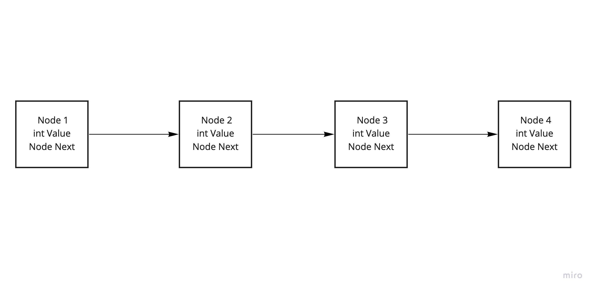
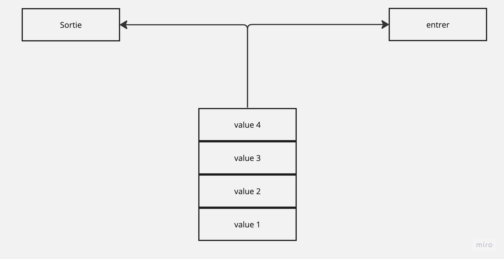
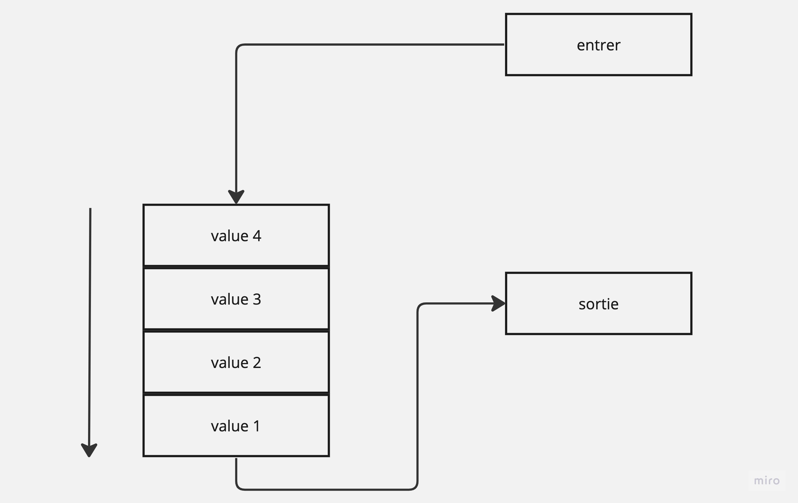
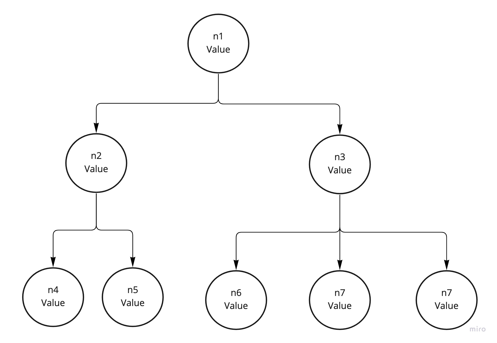
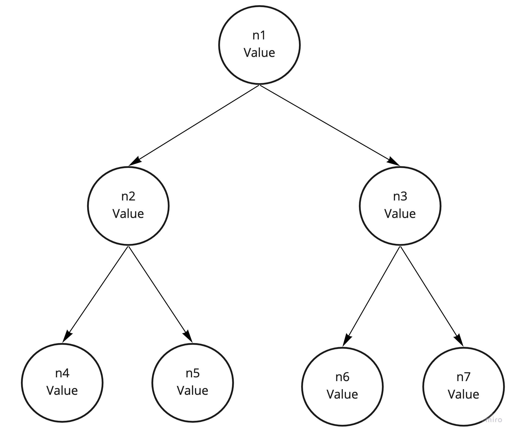
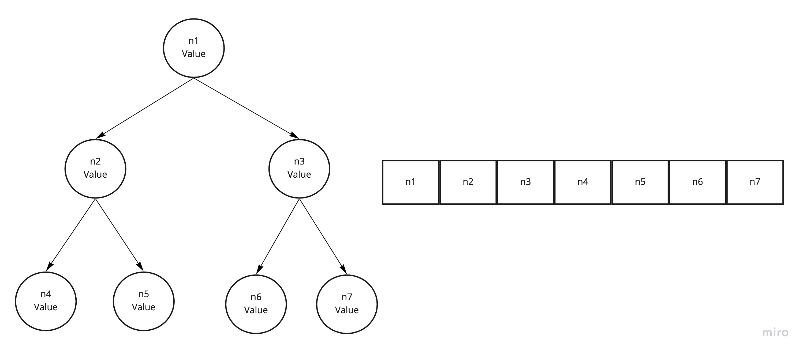

# L’algorithmique et les structures de données
## Collection et structure de donnée
### Les listes chaînées

 -  sur la figure ci-dessous on peux voire une représentation schématiquement une liste chaînée d’entiers. 


  
 qui est represanter par un objet `Node` qui implemanent une proprieter `Value` qui est un entier, une instance `Node` qui point sur le maillons suivant
 ```cs
public class Node
{
	public int Value { get; set; }
	public Node Next { get; set; }
}
 ```
 - Pour définir une liste avec un type de donnée stockée définissable au moment de l’instanciation de LinkedList il faut utiliser un type génerique `T` dans la signature de la class LinkedList
```cs
public class LinkedList<T>
{
	// code
}
```
et initialiser de la magnere suivante 
```cs
LinkedList<int> numbers = new LinkedList<int>();
LinkedList<string> strings = new LinkedList<string>();
```
- Algoritm
 1. pour Supprimer un élément on va parcourir la liste en en regardant si le mallion d'après est la valeur a supprimer si c'est le cas on sort de la boucle et définit que le maillon suivant (élément a supprimer)  est égale a sont suivant.
```cs
public void Remove(T item)
{
    MyLinkedListNode<T> tmpListToRemove = Head;

    while (tmpListToRemove.next != null) {
        if (tmpListToRemove.next.item.Equals(item)) {
            break ;
        }
        tmpListToRemove = tmpListToRemove.next;
    }
    if (tmpListToRemove.next != null)
        tmpListToRemove.next = tmpListToRemove.next.next;
    else
        RemoveLast();
}
```
2. Pour renverser le une liste il faut parcourir la liste en swapent les maillons jusqu'au dernier élément
```cs 
public void ReversList()
{
    MyLinkedListNode<T> prev = null;
    MyLinkedListNode<T> cur = Head;
    MyLinkedListNode<T> tmp;

    while(cur != null) {
        tmp = cur.next;
        cur.next = prev;
        prev = cur;
        cur = tmp;
    }
    Head = prev;
}
```
3. Pour trouver le milieux d'une liste il faut parcourir cette dernière jusqu'a la moitié du nombre totale de ces élément soit avec un `Count` soit avec une fonction qui vas les compter. Et retourner de dernier élément parcouru 
```cs
public MyLinkedListNode<T> SortMiddleList()
{
    MyLinkedListNode<T> TmpList = Head;

    for (int i = 0; i < Count / 2; i++) {
        TmpList = TmpList.next;
    }
    return TmpList;
}
```
### tableau

- La principale différence entre un tableau et une liste c'est la manière dont elle sont stocker dans la mémoire la liste a ces maillons éparpiller dans la mémoire la ou le tableau est un suite d'élément qui ce suivent dans la mémoire, on peut initialiser un tableau comme suit :
```cs
int[] integerArray = new int[] {1, 2, 3, 4};
MyObject[] objectArray = new MyObject[] { new MyObject(1), new MyObject(2) };

// on peut les parcourir avec un for
for (int i = 0; i < integerArray; i++) {
	Console.WriteLine($"{integerArray[i]}");
}

// ou avec un foreach
forach (var elem in integerArray) {
	Console.WriteLine($"{eleme}");
}
```

- voir trie dans le chapitre dédier

### Stack & Queu

- Sack est une collection qui stock les donner dans lordre d'ajout et les les sort dans ce meme ordre 
  
on crée et manipule une stack comme suit :
```cs
Stack myStack = new Stack();
 myStack.Push(1);
 myStack.Push(2);
 myStack.Push(3);

// parcour
foreach (var elem in myStack) {
	Console.Write($"{eleme}, ");
}

// result : 3, 2, 1, 
``` 

- queu vas creer un queu delement ou le premiere element element entré sera le premier sortie
  
on crée et manipule une stack comme suit :
```cs
Queue myQ = new Queue();
myQ.Enqueue(1);
myQ.Enqueue(2);
myQ.Enqueue(3);

// parcour
foreach (var elem in myQ) {
	Console.Write($"{eleme}, ");
}
// result : 1, 2, 3, 
```

### List

List est une colection qui permet de creer un tableau d'allocation dynamics, d'ajouter de supprimer mais aussi d'inserer ou supprimer un element a un index précit avec les methods `Insert` et  `RemoveAt`
```cs
\\ creation list
List<int> numbers = new List<int>() {1, 2, 3};
\\ Ajout
numbers.Add(5); \\ numbers : [1, 2, 3, 5]
\\ ajout a un index precit
numbers.Insert(3, 4); \\ numbers : [1, 2, 3, 4, 5]
\\ supprime un element a un index precit
numbers.RemoveAt(3); \\ numbers : [1, 2, 3, 5]
numbers.Clear(); \\ numbers : []
```
### HashSet

HashSet est une collection qui permet de stocker des éléments de unique :
 
 ```cs
 HashSet<int> testHash = new HashSet<int>() {1, 2};
testHash.Add(3); \\ testHash : [1, 2, 3]
testHash.Add(2); \\ testHash: [1, 2, 3]
```
pour pouvoir utiliser haset sur des class créer, il faut overide les methode `GetHashCode` et `Equal` de sort que pour deux hashCode identique `Equal` revoit true et inversement.


## Les arbres binaires

- Un arbre en informatique est un maniere de structure des donne pour pouvoir hierachiser ces dernieres Un arbre est constitué de **nœuds**, reliés entre eux par des **arêtes** selon une relations parent enfant. On distingue trois types de  **nœuds**  :

  - La  **racine**  de l’arbre est l’unique nœud ne possédant  pas de parent. *(ici noeud 1)*
  - les  **feuilles**  (ou  _nœuds externes_), éléments ne possédant  pas de fils  dans l’arbre ; *(ici noeud 4 a 7)*
   - les  **nœuds**  **internes**, éléments possédant des fils (sous-branches). *(ici noeud 2 et 3)*
  
  Le **chemin à la racine** d’un nœud est la liste des nœuds qu’il faut parcourir depuis la racine jusqu’au nœud considéré. voir ci-dessou : 
  
  



un arbre binaire est arbre qui n'as que maximum 2 **noeud** enfant par **noeud** parent, pour ce qui est d'un arbre binaire de recherche il s'agit d'un arbre binaire dont chaque nœud du sous-arbre **gauche** ait une clé inférieure ou égale à celle du nœud considéré, et que chaque nœud du sous-arbre **droit** possède une clé supérieure ou égale à celle-ci trouver une valeur dans un arbre de recherche implique une complexité moyenne de $$O(log(n))$$ et de $$ O(n) $$ dans un cas critique ou l'arbre est complètement **déséquilibré** et ressemble à une liste chaînée car il  dans ce cas il devras parcourir les *n* element *(cette complexité est la meme pour ce qui d'ajouter de nouveau element)*





- Pour implanter un Heap array il faut ajouter dans le tableaux d'abord les **Noeud** et après les **Noeud** enfant 




## Les algorithmes de tri

- le trie a bulle est un trie qui consiste a parcourir le tableau et compare les éléments consécutifs. Lorsque deux éléments consécutifs ne sont pas dans l'ordre, ils sont _permutés_, apres le premier parcoure l'element le plus grand est forcement a la fin on recommence donc le parcours en omettant le dernier element et on recommence jusqu'a avoir decremanter tout le tableau. La complexité de ce trie est de $$ O(n^2)$$ car on parcours _n_ fois les _n_ element du tableau.
```cs
public  void  bubbleSort()
{
	for (int  i  =  tab.Length;  i  >  0;  i--) {
		for (int  j  =  0;  j  <  i  -  1;  j++) {
			if (tab[j  +  1] <  tab[j]) {
				int  tmp  =  tab[j  +  1];
				tab[j  +  1] =  tab[j];
				tab[j] =  tmp;
			}
		}
	}
}
```

## Matrice 

- Les Matrice sont le plus généralement représenter sous forme de tableau de tableau comme suit: 
```
[1, 2, 3, 4]
[1, 0, 3, 4]
[1, 2, 3, 4]
[1, 2, 3, 0]
``` 
- Certaine matrice sont quasiment vide on parle alors de matrice creuse. Dans le cas cas d'une matrice dit creuse la majoriter des element de cette dernier sont egale a 0
- Pour représenter une matrice creuse on peut utiliser le format Yale Sparse Matrix qui consiste a stocker la matrice dans 3 tableau unidimensionnelle `A`, `IA`, et `JA` en considerant _n_ comme le nombre des entrer non null de la matrice _M_ : 
 
	 - `A`  et est de longueur _n_. Il contient toutes les valeurs des entrées non nulles de _M_ de gauche à droite et de haut en bas
	 - `AI` est de longueur _m + 1_ Il est défini de façon récursive telle que: _AI(0) = 0_ et _AI(i + 1) = AI(i) + n i_ ou _n i_ est le nombre d'entrer non null de la ligne courante.
	 - `JA` est de longueur _n_ contient le numéro de la colonne de chaque élément de `A`
	
- pour fair la somme de tout les element d'une matrice il faut parcourir tous les element de cette dernier et de les additionné

```cs
public int MatrixSum(int[][] matrix)
{
	int res = 0;
	foreach (var line in matrix) {
		foreach (var elem in line) {
			res += elem;
		}
	}
	return res;
}
```
pour une matrice creuse i suffit de fair la somme des element du tableau `A` 

$$
\begin{pmatrix}
1 & x & x^2 \\
1 & y & y^2 \\
1 & z & z^2 \\
\end{pmatrix}
$$
