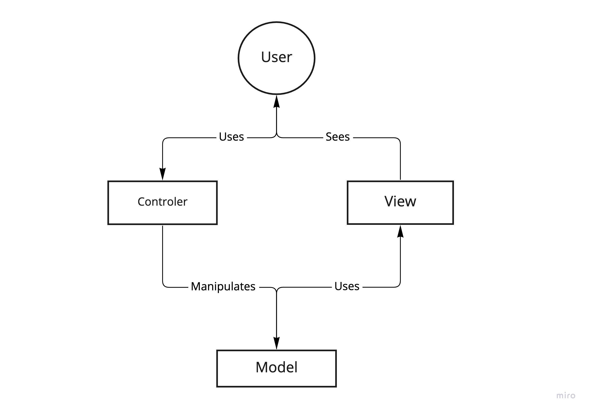
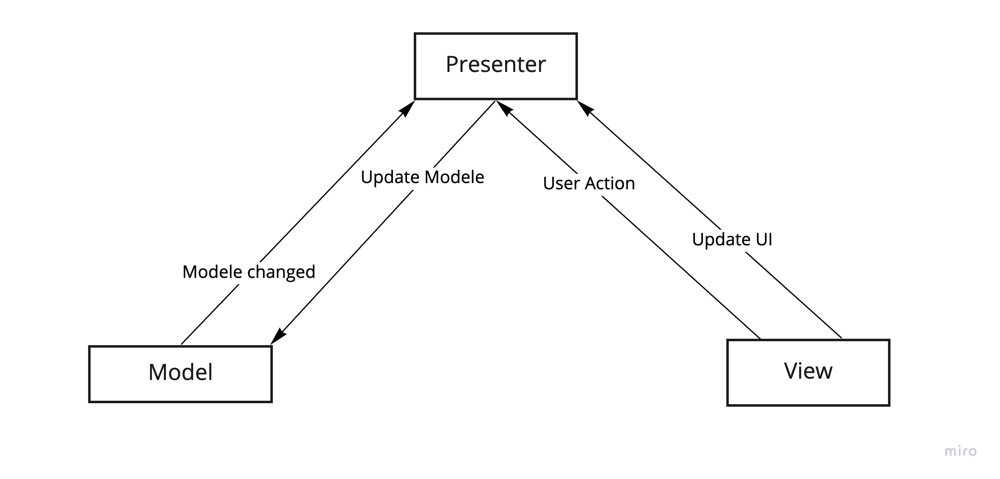
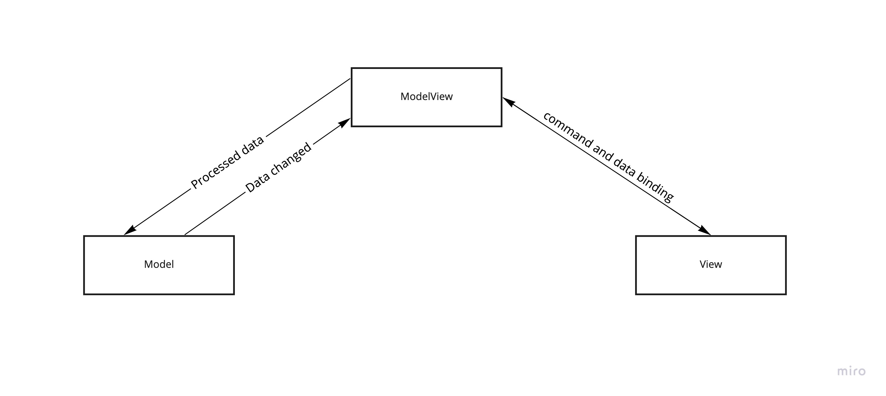

# Les Design Patterns

## Définition 

Les design pattern (patron de conception) est un arrangement standard de modules, pour fair simple il s'agit de solution standard pour répondre une problématique courante, il est considerer comme _bonne pratique_ d'utiliser des  design pattern dans le développement de logiciel.

## Gang of Four

Le gang of four est un group de 4 auteur qui on définit un certain nombre de design patterns qu'ils classent en 3 catégorie

- les patron de creation qui couvre les instanciation de class, c'est à dire de création et de configuration d'objets
- les patron de structure qui couvre la structure des class pour avoir le moins de dépendance possible entre l'implémentation et l'utilisation
- les patron de comportement qui définissent le comportement d'une class

### Decorateur

Le décorateur ou _"emballeur"_ est un design pattern qui fait parti de la famille des paterne de structure  **_gang of four_**

 
on peut voir une interface `DataSource` qui définit un contrat d'implémenter `readData` et `writeData`. Elle est Utiliser par `FileDataSource` et `DataSourceDecorator`, et pour étendre `FileDataSource` au lieu d'implémenter de nouvelle méthode dans cette dernière nous allons utiliser des décorateur par le billais de `DataSourceDecorator`, un qui compresse des donnée et un qui encrypte ces dernière.

## Pattern architectural

les pattern archticturaux suivant que sont MVC, MVP et MVVM permette principallement de séparer la logique de présentation des données de la logique de traitement des données,

### MVC

**MVC** ou **Modèle-Vue-Contrôleur** est un design pattern architectural qui a pour but de séparer les différents aspect d'une application, dans ce cas en 3 couche:

- Le **Modele** représente les donnée de l'application, leur traitement ainssi que la relation avec la base de donnée
- la **Vue** représente l'interface utilisateur elle n'effectue pas de traitement, elle affiche juste les donnée envoyer par le modèle
- le **Contrôleur** gère l'interface entre le la vue et le modèle Il va interpréter la requête de ce dernier pour lui envoyer la vue correspondante 

Dans le pattern **MVC** l'utilisateur vas faire une requette via le controller qui fait office d'eguillqge ou de chef d'ochestre et vas appeler la partie charge de traiter l'information, le modele luis vas renvoyer les donner et appliquer les *"règles métier"*, et la vue vas afficher les resultats a l'utilisateur. 

 

### MVP

**MVP** ou **Model View Présenter** est un pattern architectural comme MVC a la différence que le view ne comunique pas directement avec le model. il est découper en 3 couche comme MVC qui sont :

- Le **Modele** représente les donnée de l'application, leur traitement *(regle metier)* ainssi que la relation avec la base de donnée
- la **Vue** représente l'interface utilisateur elle n'effectue pas de traitement, elle affiche juste les donnée issue du modèle
- Le **Présentateur** récupérer les donner du modèle est applique la logique de l'interface utilisateur pour définir ce qu'il faut afficher.

 

La pricipale differance avec MVC est que dans le pattern MVP, le presenteur est en charge de la mise en place de la vue contrement a MVC ou cest la vue qui a cette fonction.

### MVVM

Le **modèle-vue-vue modèle** ou **MVVM** est un pattern architectural drivée de **MVC**  il est découpée en 3 couche comme suit :

- Le **Modele** représente les donnée de l'application, leur traitement ainssi que la relation avec la base de donnée
- la **Vue** représente l'interface utilisateur elle n'effectue pas de traitement, elle affiche juste les donnée envoyer par le modèle
- Le **View Model** fait le lien entre le model et la vue, il s'occupe de lier les donnée et eventuelement gérer des conversion.

 