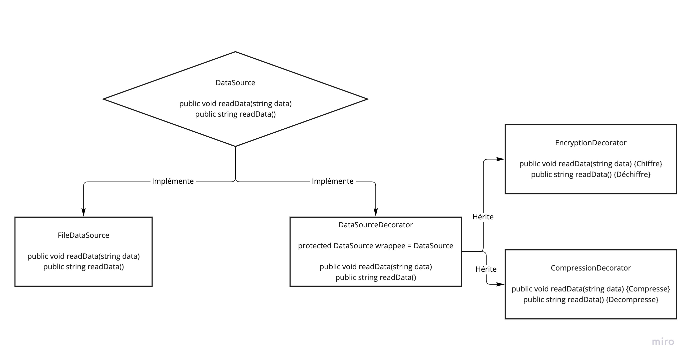
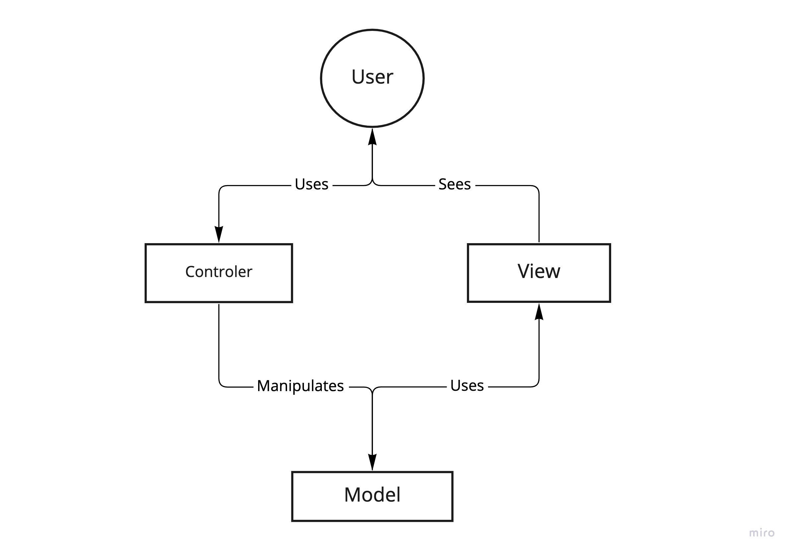
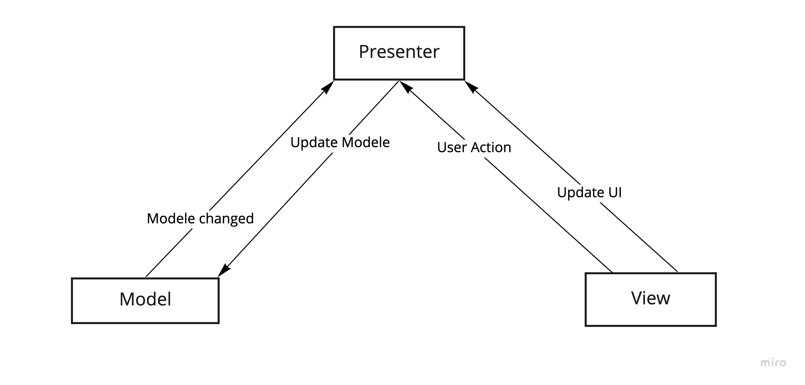
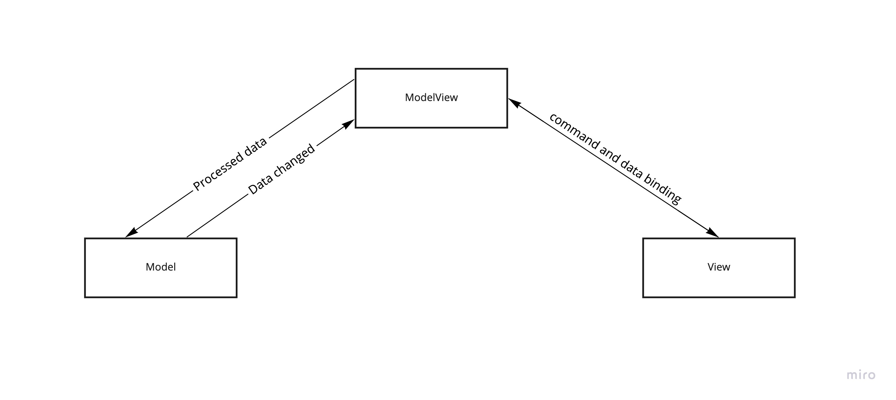

# La programmation orientée object

## Base
### les 6 principe de la OOP
les principes de base de la programmation orienter object sont :

 - L'heritage permet de réutiliser du code propre a une class de redéfinir certain de ces comportement
 - l'encapsulation est un concepte qui permet de stocker des donner en cachant l'implémentation de l'objet, c'est-à-dire en empêchant l'accès aux données par un autre moyen que les services proposés. L'encapsulation permet donc de garantir l'intégrité des données contenues dans l'objet.
 - L'abstraction permet de cacher des method ou des propriété inutile a l'utilisateur
 - Le polymorphisme permet de substituer une class parent a une class enfant
 ```cs
 public class A {}
 public class B : A {}

B instance = new A();
 ``` 
 dans cette example on voit qu'on définit un objet B qu'on instancie en luis donnant un objet `A` ca fonction car `B` hérite de `A`

 - Les Interface sont des contrat obligent les class qui les utilise a implémenté les signature cette dernière
 - les class static sont des class qui n'ont pas besoin d'être instencier pour être utiliser on peux directement appeler les method de cette dernière ce qui rejoint le principe d'abstraction vue plus haut
 
### Heritage Simple et multiple

L'heritage simple consiste a ne pouvoir hériter que d'une class comme le C# qui permet d'hériter d'une class mais de plusieurs interface, contrairement au C++ qui permet d'hériter de plusieurs class.

### Modificateurs d’accès
 
 Le C# permet de donnée l'accer ou non a certaine ressource en fonction de modificateurs que sont : 
 

 - public: accessible partout
 - private: accessible uniquement dans la class
 - protected: accessible dans la class et dans les class hériter
 - internal: accessible dans une même assembly
 - sealed: ne peut pas être hériter
 - static: ...
 - readonly: ..

## Les classes

### Class et object

Une class est un plan selon le quelle on vas construire notre objet, le programme ne manipule pas de class mais des objet, pour le programme un objet est la concrétisation d'une class.

### Class et struct 

Une structure est un ensemble de donner qui se suive dans la memoir elle sont stocker dans la stack, alors qu'une class doit être instancier et est stocker dans la hype.

###  Structures de donnée

ils existe plusieurs structures de donnée chacune d'entre elle hérite de `IEnumerable` ce qui permet de les parcourir grace a un `foreach` comme :

- les `Dictionary` qui permette de stocker dans un format clef / valeur 
- les `List` qui est un tableau a allocation dynamique
- les `Hashset` qui un tableau de clef unique

### Implémentation Dictionnaire

Le Dictionnaire est une structure de donner qui stock dans un format clef / valeur, il faut comprendre par la une clef par valeur et cette doit être unique, pour ce faire il fair un table de hachage qui transformer la clef en un int que l'on vas pouvoir utiliser comme index dans un tableau pour ce faire on vas utiliser `GetHashCode`  pour générer un hash et `Equale` pour comparer les hash, a noter que si on utilise un objet en tant que clef il faut `overide` ces deux méthode. 

### Constructeur

un constructeur est une méthode qui est appeler à l'initialisation de l'objet. [...]

### Méthode abstraite

Une class absraite posede au moins une méthode ou propriété  abstraite (sans implémentation)
```cs
public abstarct class ClassName {
	// Propriétés abstraites
	public abstract string propertieName { get; set; }
	// method pas abstrete
	public void nameMethode(int param1, char param2) {
		// implémentation
	}
	// method abstrete
	public abstract void nameMethode(int param1, char param2);
}
```
La classe implémentant les méthodes abstraites de la classe de base doit utiliser le mot clé `override`, car les méthodes abstraites sont implicitement virtuelles également.


## Les Design Patterns

### Définition 

Les design pattern (patron de conception) est un arrangement standard de modules, pour fair simple il s'agit de solution standard pour répondre une problématique courante, il est considerer comme _bonne pratique_ d'utiliser des  design pattern dans le développement de logiciel.

### Gang of Four

Le gang of four est un group de 4 auteur qui on définit un certain nombre de design patterns qu'ils classent en 3 catégorie

- les patron de creation qui couvre les instanciation de class, c'est à dire de création et de configuration d'objets
- les patron de structure qui couvre la structure des class pour avoir le moins de dépendance possible entre l'implémentation et l'utilisation
- les patron de comportement qui définissent le comportement d'une class

### Singleton

Singleton est un design pattern qui permet d'instancier un objet unique comme suit
```cs
public sealed class SingletonNotLazy<R>
{  
    SingletonNotLazy() {}  

    private static readonly object lockObj = new object();
    private static R instance = null;
    public static R Instance {  
        get {  
            lock(lockObj) {  
                if (instance == null) {  
                    instance = new R();  
                }  
                return instance;  
            }  
        }  
    }  
} 
```
on peut voir que nous avons un class sealed qui as une instance d'un objet `T` qui si il est deja instancier ne seras pas reinstancier le lock permet d'être **_thread safe_** ce qui veut dire que deux thread ne peuvent pas accéder a un meme element en meme temps.
```cs
public sealed class Singleton<R> where R: new()
{
    private Singleton()
    {}

    private static readonly Lazy<R> lazy = new Lazy<R>(() => new R()); 
    public static R Instance    
    {    
        get    
        {
            return lazy.Value;    
        }    
    }
}
```
ont peut voir dans cette nouvelle version qu'ont ne regarde plus si la propriété est instancier car la method est static est donc ne s'execute qu'une fois par processus de l'application 
`Lazy` dans ce contexte permet de faire de l'initialisation tardive ce qui veut dire que l'objet seras instancier a sont utilisation.

### Decorateur

Le decorateur ou _"embaleur"_ est un design pattern qui fait parti de la famille des paterne de structure  **_gang of four_**

  

on peut voir une interface `DataSource` qui définit un contrat d'implémenter `readData` et `writeData`. Elle est Utiliser par `FileDataSource` et `DataSourceDecorator`, et pour étendre `FileDataSource` au lieu d'implémenter de nouvelle méthode dans cette dernière nous allons utiliser des décorateur par le billais de `DataSourceDecorator`, un qui compresse des donnée et un qui encrypte ces dernière.

### MVC

**MVC** ou **Modèle-Vue-Contrôleur** est un design pattern architectural qui a pour but de séparer les différents aspect d'une application, dans ce cas en 3 couche:

- Le **Modele** représente les donnée de l'application, leur traitement ainssi que la relation avec la base de donnée
- la **Vue** représente l'interface utilisateur elle n'effectue pas de traitement, elle affiche juste les donnée envoyer par le modèle
- le **Contrôleur** gère l'interface entre le la vue et le modèle Il va interpréter la requête de ce dernier pour lui envoyer la vue correspondante 

 

### MVP

**MVP** ou **Model View Présenter** est un pattern architectural comme MVC a la différence que le view ne comunique pas directement avec le model. il est découper en 3 couche comme MVC qui sont :

- Le **Modele** représente les donnée de l'application, leur traitement ainssi que la relation avec la base de donnée
- la **Vue** représente l'interface utilisateur elle n'effectue pas de traitement, elle affiche juste les donnée envoyer par le modèle
- Le **Présentateur** récupérer les donner du modèle est applique la logique de l'interface utilisateur pour définir ce qu'il faut afficher.

 

### MVVM

Le **modèle-vue-vue modèle** ou **MVVM** est un pattern architectural drivée de **MVC**  il est découpée en 3 couche comme suit :

- Le **Modele** représente les donnée de l'application, leur traitement ainssi que la relation avec la base de donnée
- la **Vue** représente l'interface utilisateur elle n'effectue pas de traitement, elle affiche juste les donnée envoyer par le modèle
- Le **View Model** fait le lien entre le model et la vue, il s'occupe de lier les donnée et eventuelement gérer des conversion.

 

## Le Multithreading

### Thread / Processus 

Un  processus est programme en cour d'éxécution c'est lui qui execute les instruction du programme, il a également un espace d'adressage en mémoire vive (sur la RAM) pour contenir la hype alors qu'un thread est un segment d'un processus. Un processus peut avoir de nombreux thread et tous ces thread sont stocker dans le processus.

### Tread / Task

- `Task`  est une class de c# qui permet de créer une tache qui sera executer de manière asynchrone, contrairement a thread, task ne crée pas de nouveau thread mais vas chercher dans thread pull. Task peu  également dire si il a fini ca tache et retourner une valeur. Task est une promesse d'avoir un résultat dans l'avenir comme `Task.Delay()` qui n'utilise pas de CPU réel, mais reviens plus a lancer une minuterie,  `Task.Run()` reviens a dire je veux exécuter ce code séparément  .Pour résumer `Task` est plus une abstraction de "où executer le code", c'est une promesse de résultats. 

- `Thread` est une class qui vas prendre en charge un bloque d'instruction et l'executer a coter de la tram principe du programme, il a sa propre zone mémoire (stack, la hype et commune a tous les thread du processus). `Thread` est plus bas niveau que `task` et ne vas pas chercher un `thread` dans un pool mais bien créer un nouveau thread, il sera donc séparer du pool de thread et éxécuter à par. On implemente un thread comme suit
```cs
// on creer un nouvelle obj ThreadStart pour une methode qui ne prend pas d'argument
Thread t = new Thread(new ThreadStart(function));
// ou
Thread t = new Thread(function);
t.Start();

// pour une methode qui prend un argument on vas creer un delegate : public  delegate  void  ParameterizedThreadStart(object obj)
Thread t = new Thread(function);
t.Start(parametre);

``` 

### synchrone asynchrone

Une méthode synchrone est une méthode qui vas executer des instruction les une après les autre, la ou la méthode asynchrone les executeras tout en meme temps si on ne spécifie pas d'attendre que instruction ou un bloque d'instruction soit executer. Une methode Asyncron revoie une `Task` soit une promesse de résultat.

### Section critique 

Une section critique est une portion de code ou il ne peu y avoir plus un thread simultanément. On peut s'assurer de ça en utilisant des mutex qui est une class qui permet de synchronisé l’accès à une ressource protégée  en interdisant l'accès à celle-ci par tout les autre thread. 

### Deadlock / liveLock

Le Deadlock ou interblocage est la situation dans laquelle 2 threads s’attendent mutuellement,

### Objets mutable / immuable

Un objet mutable est un objet qui être modifier contrairement a un objet immuable qui, luis, ne l'est pas comme par exemple `String` qui si on veut changer ca valeur, il faut le supprimer et le recréer.

### Appelle bloquant

Un appelle bloquant survient quand un thread fait un appelle système, ce dernier est bloquer tant que le systeme n'a pas terminer, ce qui peut etre long selon les cas, l'un des example fontion pouvant provoquer un appelle bloquant est `read()`.

### Mutex

Mutex est une class de C# .net bloquant l'accès a une section proteger, permetant a un seul thread a la fois d'y accéder, bloquant les autre a lentrer du Mutex, un Mutex revient retaper `Lock`. On definit le debut de la section proteger en mettant `"MutexIstance".WaitOne()`, et la fin en mettant `"MutexInstance".ReleaseMutex()`
```cs
public class testMutex {
	private  static Mutex mut = new Mutex();
	
	public void CreatThred() {
		for (int i = 0; i < number_of_thread; i++) {
			Thread newThread = new Thread(new ThreadStart(methodName));
			newThread.Start();
		}
	}
	
	public void methodName() {
		// before protected section
		mut.WaitOne();
		// protected section
		mut.ReleaseMutex();
		// end of protected section
	}
}
```
On peu egalement utiliser `WaitOne()` pour set un timeout qui si la section protege prend plus de temps que celui indiquer (en ms) alors renvoie false, et le thread qui attand la section n'aquiere pas le mutex et donc n'appelle pas `ReleaseMutex()` qui est appeler uniquement par le tread qui est entrer.
```cs
public class testMutex {
	private  static Mutex mut = new Mutex();
	
	public void CreatThred() {
		for (int i = 0; i < number_of_thread; i++) {
			Thread newThread = new Thread(new ThreadStart(methodName));
			newThread.Start();
		}
	}
	
	public void methodName() {
		// before protected section
		if (mut.WaitOne(1000)) {
			// protected section
			mut.ReleaseMutex();
			// end of protected section
		} else {
			// timeout
		}
	}
}
```
