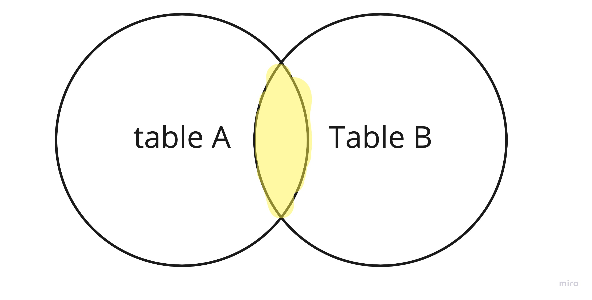

# Langage SQL

## La manipulation de tables

### mot clef

- `SELECT * FROM table WERE condition` = selectionne tous d'une pour une condition 
- `GROUP BY` regroup les donner dune meme ressource ex : 

|Nom| valeur|
|--|--|
| A|10|
|A|9|
|B| 10|
|A| 1|
|B| 2|

`SELECT nom, SOMME(valeur F) FROM table GROUP BY nom`

|Nom| valeur|
|--|--|
| A|20|
|B| 12|

- `SELECT v1, v2 FROM table GROUP BY v1 HAVING COUNT(v2) > 2` La clause `HAVING` a été ajoutée à SQL car le mot clé WHERE ne peut pas être utilisé avec les fonctions d'agrégation.
- Supprimer un element:  `DELETE FROM table_name WHERE condition`
- Supprimer toute les donnee d'une table: `TRUNCATE TABLE utilisateur`  
- Supprimer la talbe `DROP TABLE nom_table` 
- metre a jour des donner : `UPDATE table SET nom_colonne_1 = 'nouvelle valeur' WHERE condition `
-  Renomer table: `RENAME TABLE old_table_name TO new_table_name`
-  Insérer une colonne : `ALTER TABLE nom_table ADD nom_colonne type_donnees`
- Supprimer une colonne `ALTER TABLE nom_table DROP columne`

## Jointure

une jointure permet de fusionner les resultats de plusieur table il ya 6 type de jointure : 

### INNER JOIN 

 
jointure interne pour retourner les enregistrements quand la condition est vrai dans les 2 tables. C’est l’une des jointures les plus communes.
```sql
SELECT tableA.value1, tableB.value1, tableA.value2 
FROM tableA
INNER JOIN tableB
ON condition # souvent :: tableA.tablebId = tableB.id
WHERE condition
```

### LEFT JOIN 

 
jointure qui renvoie tous element de la `Table A` et les element de la `Table B` repondand a une condition.
```sql
SELECT tableA.value1, tableB.value1, tableA.value2 
FROM tableA
LEFT JOIN tableB
ON condition # souvent :: tableA.tablebId = tableB.id
WHERE condition
```

### RIGHT JOIN 

 
jointure qui renvoie tous element de la `Table B` et les element de la `Table A` repondand a une condition.
```sql
SELECT tableA.value1, tableB.value1, tableA.value2 
FROM tableA
RIGHT JOIN tableB
ON condition # souvent :: tableA.tablebId = tableB.id
WHERE condition
```

### FULL JOIN

 
jointure externe pour retourner les résultats quand la condition est vrai dans au moins une des 2 tables. le champ qui match pas sont remplasser par `null`

```sql
SELECT tableA.value1, tableB.value1, tableA.value2 
FROM tableA
RIGHT JOIN tableB
ON condition
WHERE condition
```

### NATURAL JOIN

le natural join premet de fusionner deux table qui une ou des colonne en commun et sortira tous les champ identique, il n'y a pas besoin de `ON` du coup.

```sql
SELECT *
FROM table1
NATURAL JOIN table2
```

### CROSS JOIN


Le `CROSS JOIN` permet de, pour chaque ligne dune table A, on retournera toute les ligne d'une table B jointe a la ligne en question. Elle est souvent jointe a un `WHERE` pour filtrer les résultats.

```sql
SELECT *
FROM table1
CROSS JOIN table2
```

### SELF JOIN

SELF JOIN permet de joindre une table avec elle meme [......]

```sql
SELECT `u1`.`u_id`, `u1`.`u_nom`, `u2`.`u_id`, `u2`.`u_nom`
FROM `utilisateur` as `u1`
LEFT OUTER JOIN `utilisateur` as `u2` ON `u2`.`u_manager_id` = `u1`.`u_id`
```

## Mise en application

En SQL un index est une clef unique permentant d'identifier un element dans une table. Il sont utilisés pour récupérer les données de la base de données plus rapidement qu'autrement. Les utilisateurs ne peuvent pas les voir, ils sont juste utilisés pour accélérer les recherches/requêtes.pour creer un Index il faut utiliser l'instruction CREATE INDEX.

```sql
# cree un index
CREATE  INDEX  _index_name_  
ON  _table_name_ 

#cree un index unique 
CREATE  UNIQUE  INDEX  _index_name_  
ON  _table_name_
```
On peut aussi creer un index sur ou plusieur colonne 
```sql
#Une col
CREATE  INDEX  _index_name_  
ON  _table_name_ (_column1_);
# Plusieur col
CREATE  INDEX  _index_name_  
ON  _table_name_ (_column1_, _column2_, ...);
```
## Mise en application

- En SQL un index est une clef unique permentant d'identifier un element dans une table. Il sont utilisés pour récupérer les données de la base de données plus rapidement qu'autrement. Les utilisateurs ne peuvent pas les voir, ils sont juste utilisés pour accélérer les recherches/requêtes.pour creer un Index il faut utiliser l'instruction CREATE INDEX.
```sql
# cree un index
CREATE  INDEX  _index_name_  
ON  _table_name_ 

#cree un index unique 
CREATE  UNIQUE  INDEX  _index_name_  
ON  _table_name_
```
On peut aussi créer un index sur ou plusieur colonne 
```sql
#Une col
CREATE  INDEX  _index_name_  
ON  _table_name_ (_column1_);
# Plusieur col
CREATE  INDEX  _index_name_  
ON  _table_name_ (_column1_, _column2_, ...);
```
- Les procédures stockées est un concept de gestion de base de donnée, c'est un ensemble d'instruction SQL, c'est comme une fonction.
 ```sql
 `CREATE PROCEDURE  
insert_data(a integer, b integer)  
LANGUAGE SQL  
AS $$  
INSERT INTO tbl VALUES (a);  
INSERT INTO tbl VALUES (b);  
$$;` 
 ```
 Pour exécuter la procédure stockée, il est possible d’exécuter la requête SQL suivante :
 ```sql
 CALL insert_data(1, 2);
 ```
 - une primary key est un index, chaque table peut contenir qu'une seul primary key qui ce doit d'etre unique, L’usage le plus fréquent consiste à créer une colonne numérique qui s’incrémente automatiquement à chaque enregistrement grâce à AUTO_INCREMENT.
```sql
CREATE TABLE `nom_de_la_table` (
  id INT PRIMARY KEY NOT NULL AUTO_INCREMENT,
  [...]
);
```
- Une clef secondaire est une clef qui n'est pas unique qui sert a identifier des element dans une table comme le sont par exemple les clef extern qui, le plus souvent, est une clef primaire d'une autre table par exemple imaginons que nous avons une table users et une table comment dans comment on vas avoir l'id de l'utilisateur qui a poster le commentaire et etant donner qu'un utilisateur peux poster plusieurs commentaire cette id ne serat pas unique.
```sql
# user table
CREATE TABLE `users` (
  id INT PRIMARY KEY NOT NULL AUTO_INCREMENT,
  [...]
);

# comments table
CREATE TABLE `comments` (
  id INT PRIMARY KEY NOT NULL AUTO_INCREMENT,
  user_id INT REFERENCES users(id),
  [...]
);

# ou ||
CREATE TABLE `comments` (
  id INT PRIMARY KEY NOT NULL AUTO_INCREMENT,
  FOREIGN KEY (user_id) REFERENCES users(id),
  [...]
);
```
- Les contrainte sont des regles restreignant les valeur mise en base, ce qui permet un degres de fiabiliter et de protection suplemantaire, en garantissant l'exactitude et la fiabilité des donnée, elles peuvent s'appliquer au niveau de la table en entier ou a une seule colonne, les plus courent sont: 
  - `NOT NULL` qui interdit davoir des element null dans la table ou colonne selon ou a ete appliquer la contrainte
  - `DEFAULT` permet de definir une valeur par defaut 
  - `UNIQUE` definit qu'on ne peut pas retrouver deux fois le meme element dans une colonne
  - `CHECK` fait que tous les element doivent valider une condition
  - `INDEX` comme vue plus haut elle permet de cree un index
 
 ```sql
 CREATE TABLE `comments` (
  id INT PRIMARY KEY NOT NULL AUTO_INCREMENT,
  FOREIGN KEY (user_id) REFERENCES users(id),
  creation_date DATE DEFAULT NOW()
  email VARCHAR(255) NOT NULL UNIQUE
  age INT CHECK(age >= 18)
);
```
 -Une fonction de groupe permet de faire un calcule sur l'ensemble des elements d'une colonne grace a un `SELECT`, exemple: 
 ```sql
 #Donner le total des salaires du département 10.
 SELECT SUM(salaire)
FROM emp
WHERE n_dept = 10;

#Donner le nom, la fonction et le salaire de l'employé (ou des employés) ayant le salaire le plus élevé.
SELECT nom, fonction, salaire
FROM emp
WHERE salaire = (SELECT MAX(salaire)
                 FROM emp);
 ```
 - `HAVING` permet de filtrer en utilisant des fonctions telles que SUM(), COUNT(), AVG(), MIN() ou MAX() contrairement a `WHERE` qui ne les supporte pas.
 ```sql
 SELECT * FROM `table` HAVING COUNT(`value`) > number
 ```
 - Pour retourner un nombre limiter de valeur il faut utilser le mot clef `LIMIT`
 ```sql
 SELECT * FROM `table` LIMIT 10
 ```
 - Un trigger ...
